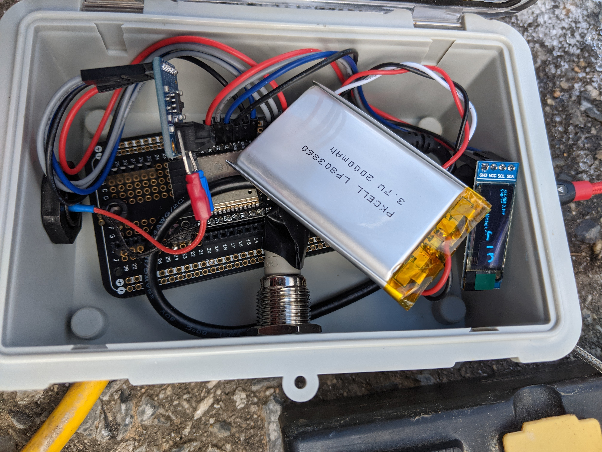
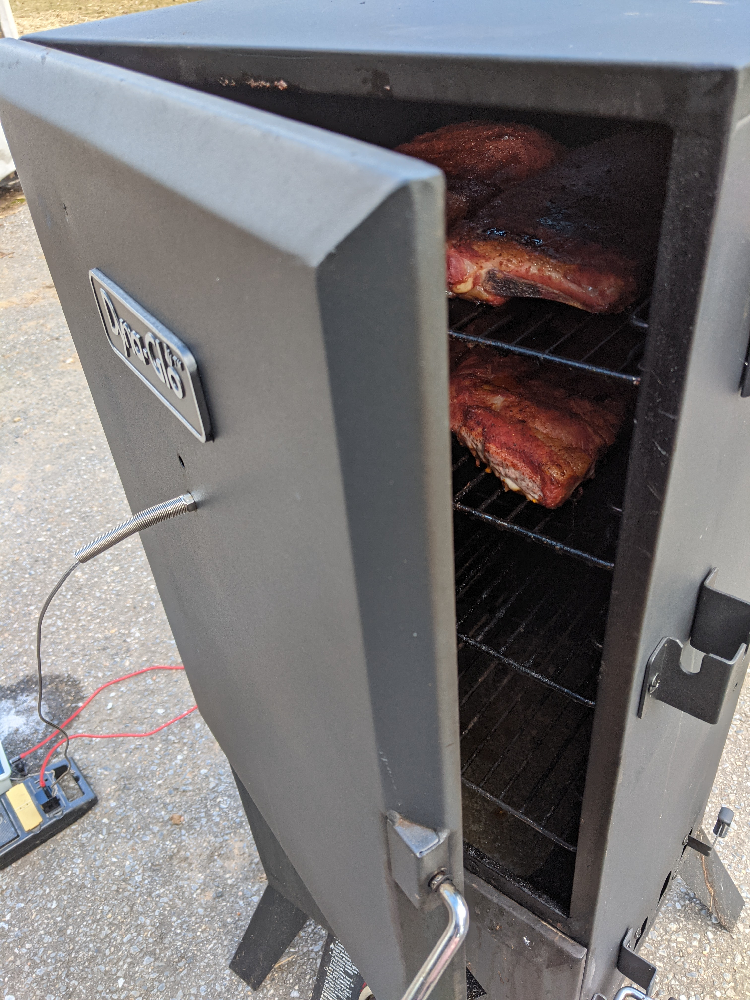

# pitboss
I'm a (very) amateur smoker of meats and found myself dissatisfied with
commercially available wireless thermometers rated for use in smokers, so I
decided to build my own. Here are the results:

* Powered by Espressif ESP-32S [with Arduino](https://github.com/espressif/arduino-esp32)
* Reads smoker temperature
* Temperature and debugging information presented via JSON:
```json
{
  "time": "Sat Mar 6 09:40:08 2021",
  "coldJunction": 66.3125,
  "hotJunction": 230.9,
  "debug": {
    "heap": 178172,
    "rssi": 86,
    "ssid": "comcats-outside"
  }
}
```
* Captive portal for connecting to WiFi network
* OLED display with auto-shutoff
* Multipurpose button for turning on OLED display, putting the system to sleep, and
  resetting WiFi configuration.
* Powered via battery or USB Micro B
* Debug messages sent via fake serial over USB thingie

## Bill of Materials
### HiLetgo ESP32S
https://www.amazon.com/gp/product/B077KJNVFP

You can use any ESP32 dev board you want, but I chose this one because it was cheap,
doesn't require pressing a button to flash, and includes a LiPo charging circuit.

### MAX31855 Thermocouple Amplifier
https://www.adafruit.com/product/269

Works with K-Type thermocouples!

### T-PRO K-Type Thermocouple
https://www.amazon.com/gp/product/B0748DFJFN

Again, use any K-Type thermocouple you like, but I chose this one for the price and
the design. The threaded portion and nut allowed for easy mounting to the door of my
smoker.

### Button
https://www.adafruit.com/product/917

Looks and feels nice, has LED for feedback.

### 3.7v 2000mAh LiPo Battery
https://www.adafruit.com/product/2011

Cheap, and lasts several days of continuous use between charging in my setup.

### USB Micro B Panel Mount Extension Cable
https://www.amazon.com/gp/product/B0816BP7KT

Worked nicely with my project box, and has a water resistant, screw-on cap.

### Waterproof Cable Gland
https://www.amazon.com/gp/product/B01MDTUIIA

Allows for the thermocouple cable to go into the project box with a little water
resistance for rainy days.

## How to Build (the firmware)
1. Clone the repo
2. Have [platformio](https://platformio.org/) installed
3. `platformio run -t debug`
4. `platformio run -t upload`
5. `platformio run -t uploadfs`

## How to Build (the hardware)
1. Learn to solder (poorly in my case)
2. Make it look like this:
   
   